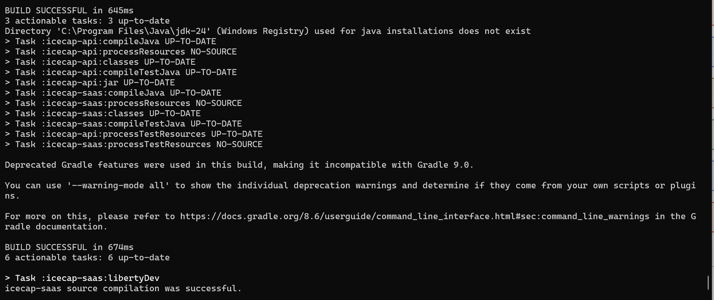

# ICECAP-LIBERTY

### INTRO:

The intent behind this project is to act as a clone of the famous NHL salary cap tracker website known as CapFriendly. It is Java based microservice and used Liberty as an application server. The front end microservice is built using NodeJs.

### RELATED PROJECTS:

The front end of this application is found in `https://github.com/acresion/icecap-nodejs`

### SETUP:

- Navigate to: [download liberty ](https://www.ibm.com/support/pages/websphere-liberty-developers)
- Download `WebSphere Liberty Kernel 25.0.0.5`
- Unzip to folder of your choice
- Navigate to folder, enter bin directory
- Create server using `./server create [server_name]`

At this point, you have now created a new server, which can be found in `./usr/servers/[server_name]`. The rest of the configurations in the server goes into the server folder

### SERVER.XML CONFIG

After creating your server using the instructions above, navigate to `./usr/servers/[server_name]` and edit the `server.xml` file.

```xml
<?xml version="1.0" encoding="UTF-8"?>
<server description="new server">

    <!-- Enable features -->
    <featureManager>
        <feature>jndi-1.0</feature>
		<feature>jaxrs-2.0</feature>
		<feature>openapi-3.1</feature>
		<feature>localConnector-1.0</feature>
		<feature>concurrent-1.0</feature>
    </featureManager>

    <!-- This template enables security. To get the full use of all the capabilities, a keystore and user registry are required. -->
    
    <!-- For the keystore, default keys are generated and stored in a keystore. To provide the keystore password, generate an 
         encoded password using bin/securityUtility encode and add it below in the password attribute of the keyStore element. 
         Then uncomment the keyStore element. -->
    <!--
    <keyStore password=""/> 
    -->
    
    <!--For a user registry configuration, configure your user registry. For example, configure a basic user registry using the
        basicRegistry element. Specify your own user name below in the name attribute of the user element. For the password, 
        generate an encoded password using bin/securityUtility encode and add it in the password attribute of the user element. 
        Then uncomment the user element. -->
    <basicRegistry id="basic" realm="BasicRealm"> 
        <!-- <user name="yourUserName" password="" />  --> 
    </basicRegistry>
    
    <!-- To access this server from a remote client add a host attribute to the following element, e.g. host="*" -->
    <httpEndpoint id="defaultHttpEndpoint"
                  httpPort="9080"
                  httpsPort="9443" />
                  
    <!-- Automatically expand WAR files and EAR files -->
    <applicationManager autoExpand="true"/>
	
	<!-- Make sure the dropins points to the location where the application war is rebuilt -->
		<applicationMonitor dropins="C:/work/git/icecap/liberty/repo/icecap-liberty/icecap-saas/build/libs" updateTrigger="mbean"/>
		<openapi publicURL="icecap/v2"/>

</server>

```

### SERVER.ENV

By default, Liberty is shipped with a config that requires a remote debugger to connect to it prior to starting the application. If you want to config it to avoid waiting the debugger, open up the server.env file and type in the line:

```properties
WLP_DEBUG_SUSPEND=n
WLP_LOGGING_MESSAGE_FORMAT=json
WLP_LOGGING_MESSAGE_SOURCE=message,trace,accessLog,ffdc,audit
WLP_LOGGING_CONSOLE_LOGLEVEL=info
```

### JAVA

- Navigate to [download](https://www.oracle.com/java/technologies/javase/jdk17-archive-downloads.html)
- Download Windows x64 Installer (for Windows only).
- Run the installer, and follow instructions.

### ENV:

Once you have successfully completed the following instructions, make sure to set `JAVA_HOME` to the directory where you recently installed `JAVA 17`. 

### GRADLE BUILD:

The solution uses Gradle to build the application. It includes a Gradle wrapper to help get started. Once you cloned the repo, navigate to the root folder `${cloned_location}\icecap-liberty` and invoke `./gradlew assemble` If the command completes  successfully, navigate to `${cloned_location}\icecap-liberty\icecap-saas\build\libs` which is expected to contain the application war file. Make sure that liberty `server.xml` dropins is configured to monitor this directory 

### RUNNING:

- Open up two terminal tabs, with one tab pointing to the bin of your manual Liberty server, and the other pointing to the directory of your application
- Build the current Gradle project using `./gradlew build`
- If the Liberty server is currently running, stop it using `Control + C`
- Start it using `./server debug [server_name]`

### GRADLE.PROPERTIES:

- Find the file called gradle.properties.template
- Follow the instructions provided on the file

### DOCKER
- Push the changes to `GitHub`. The gitaction provided will automatically build a new Docker container
- Pull the Docker containers using the command `./restartDeployment.sh`
- Run the Kubernetes pods using the command `kubectl port-forward service/icecap-liberty-service 3000:3000`
- Note you will need to set up secrets prior to running the script. The command is this:
	`kubectl delete secret icecap-api-secret --ignore-not-found`
    `kubectl create secret generic icecap-api-secret --from-literal=mysql_user=<username> --from-literal=mysql_password=<password>`
- If you want to view the logs of a pod, remember to run the command `kubectl logs <pod_name>`

- curl command you can use to test your application:
curl -X 'GET' \
  'http://icecap-api-service.default.svc.cluster.local:9080/icecap/v2/leagues' \
  -H 'accept: application/json'
-exec to a pod:
	`kubectl exec -it <pod_name> -- /bin/sh`


### SCREENSHOTS:
- Command line output after running ./gradlew libertyDev



- Swagger UI page for API testing


- DockerHub page containing every Docker image in the current namespace

- GitHub actions that are responsible for running the unit tests, building the container, and pushing to DockerHub


